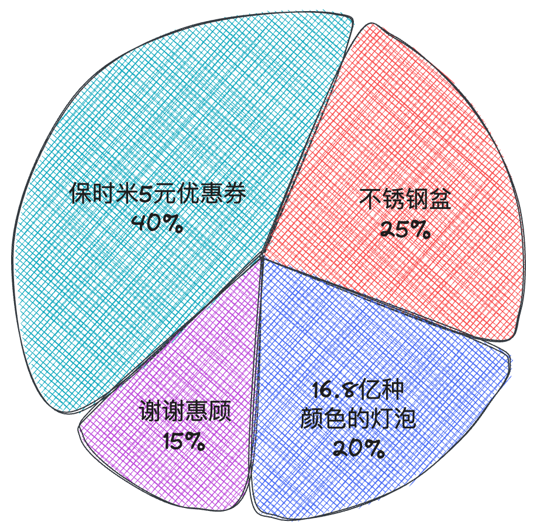
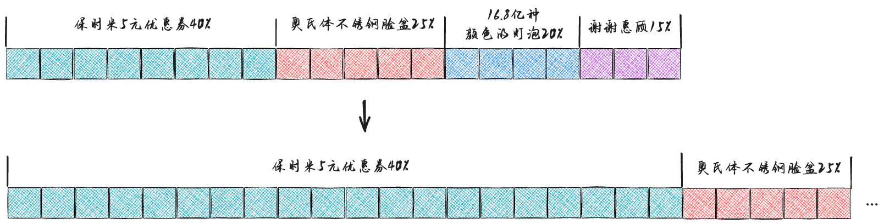
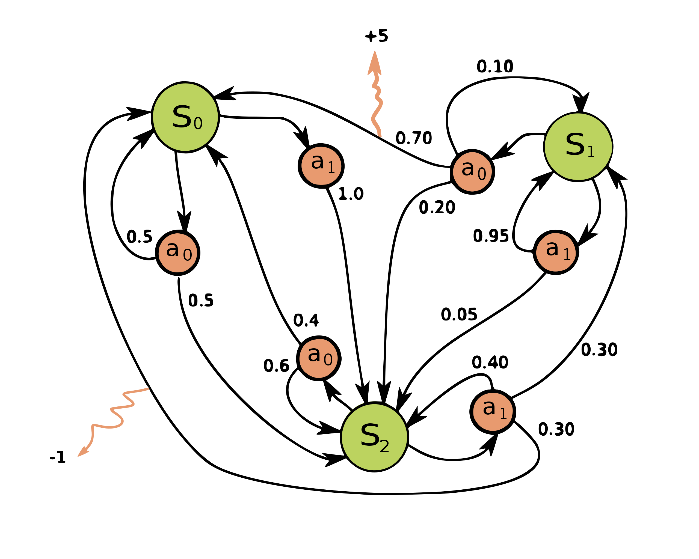
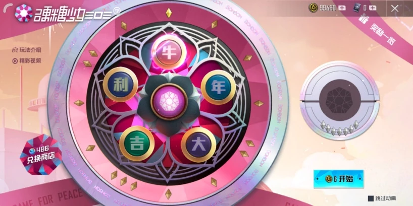
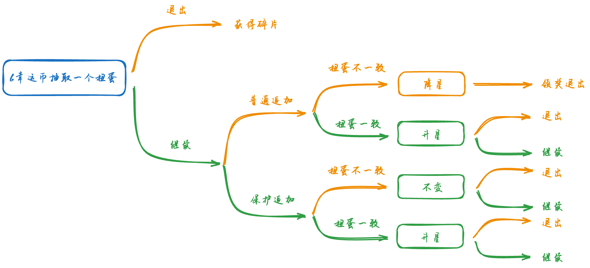

# 抽奖

> 说到抽奖，在我们日常生活中随处可见，比如说超市搞活动、年会抽奖、游戏中抽英雄皮肤等等。

## 1. 轮盘选择法

轮盘选择法是一种直观易懂的抽奖模型，适用于奖品概率相对均匀的情况。其实现步骤包括：

将所有奖品按照中奖概率映射到一个圆盘上的不同扇区。
生成一个随机数作为指针，指向的扇区即为中奖奖品。

举个 🌰： 为了回馈各位米粉朋友们，雷总连夜说服高管，和当地超市联合举办了一项抽奖活动，凡超市购物满 1000 元者获赠一次抽奖机会。



从图中可以看出，中奖的概率是由旋转的角度所决定的，假如我们每次都从图中指针开始旋转，指针转过下图对应角度范围的整数倍即可获得对应的奖品。

| 奖品              | 中奖角度 | 角度范围   |
| ----------------- | -------- | ---------- |
| 保时米5元优惠券   | 144      | 1 ～ 144   |
| 奥氏体不锈钢脸盆  | 90       | 145 ～ 234 |
| 16.8 亿种颜色灯泡 | 72       | 235 ～ 306 |
| 谢谢惠顾          | 54       | 307 ～ 360 |

总之，轮盘选择法是一种简单的抽奖模型。

## 2. 原神中的抽奖模型

原神作为比较典型的抽卡游戏，吸引了很多玩家，也因为其比较独特的保底机制让运气并不怎么好的玩家也能抽到自己喜欢的角色。

所以原神的抽奖模型可以用保底机制 + 优先级原则 + 轮盘选择法的变形来描述。

### 2.1 保底机制

拿原神限定角色池来讲，一个池子中可能会抽到的东西包括这几种：

- 5星
  - 限定5星角色（1个）
  - 常驻5星角色（截止目前有7个）
- 4星
  - 限定4星角色（3个）
  - 其他4星角色（3个之外的其他所有4星）
- 3星
  - 3星武器

有如下抽卡保底规则：

- 90抽之内必出5星，10抽之内必出4星。
- 本次5星未出限定，下次5星必出限定。

### 2.2 优先级原则

优先级原则很简单，就是一次抽奖如果权重同时符合不同的星级，高星级优先。

### 2.3 轮盘选择法变形

如果完全根据轮盘角度来进行选择，实现让玩家必得某类物品的功能会比较繁琐，所以我们将轮盘简单的变形为下图所示：

我们以前面超市购物为例，权重上限我们设置为 `20`，那么正常情况下我们抽取到 `保时米5元优惠券` 所占的权重为 `20 * 40% = 8`
如果想让用户百分百抽到优惠券，那么我们只需将权重改为 `20 * 100% = 20`（也就是权重上限）就行了。



原神中的保底也是同样的道理，不同的是这个权重不是一下子变为权重上限的，而是动态调整的，为了不出现小数，我们将整个权重上限设置为 10000，抽取限定角色池不同星级的权重可以用下面方法求出：

```ts
/**
 * 获取对应星级角色的权重
 * @param rank 星级
 * @param count 距上次出对应星级的抽数
 * @returns 权重
 */
function getRoleWeight(rank: number, count: number) {
  let res = 0
  count += 1
  if (rank === 5 && count <= 73) {
    res = 60
  } else if (rank === 5 && count >= 74) {
    res = 60 + 600 * (count - 73)
  } else if (rank === 4 && count <= 8) {
    res = 510
  } else if (rank === 4 && count >= 9) {
    res = 510 + 5100 * (count - 8)
  }
  return res
}
```

一次抽卡我们随机一个 1 ~ 10000 的正整数，通过对比是否落在对应星级的权重范围内，再根据星级 5 > 4 > 3 的顺序就可以确定这次抽卡最终的结果。

```ts
/**
 * 获取此次抽到的角色星级
 * @returns 3 ｜ 4 ｜ 5
 */
function getRoleRank() {
  // 随机一个 1～10000的正整数
  const weight = getRandomNum()
  const weight5 = getRoleWeight(5, state.no_r5_count)
  const weight4 = getRoleWeight(4, state.no_r4_count)

  if (weight <= weight5) {
    return 5
  } else if (weight <= weight4) {
    return 4
  }
  return 3
}
```

## 3. 马尔可夫链和马尔可夫决策

在更多的抽奖或者类抽奖系统中，都会根据用户的不同行为，对最后的奖品获得给予干预，使得整个抽奖过程更加随机和更加的刺激紧张。

举个 🌰：某挑战综艺节目，通过第一关给参赛者 1W 元奖励，此时退出可以拿走奖金，继续挑战第二关并且成功的话奖金翻倍，挑战失败奖金归零，挑战者能拿到多少奖金跟挑战者的选择密切相关。

因此，在一些设计复杂的抽奖系统中，为了更好的分析最后的收益和用户行为，往往会引入 `马尔可夫链` 的概念。

### 3.1 什么是马尔可夫链

马尔可夫链（Markov chain），因俄国数学家安德烈·马尔可夫得名。马尔可夫链是指一个随机过程，在该过程中，从一个状态转移到另一个状态的概率只依赖于当前状态，而不依赖于过去的状态。这个性质称为马尔可夫性质或者无后效性。具体来说，给定一个状态空间和一个初始概率分布，马尔可夫链可以描述在这个状态空间中状态之间的转移规律。

有三大特性：

- 无记忆性
- 状态空间
- 概率转移矩阵

再举个🌰：小明早餐习惯在 `包子`、`油条`、`麻花` 中选择，小明明天吃什么，只会由今天吃的是啥决定（毕竟只吃一种会腻），跟昨天以及更早都没关系。
好的，我们可以用马尔可夫链来描述小明的早餐选择习惯。假设小明每天早上都会选择其中一种早餐，包括包子、油条和麻花。他的选择是随机的，但是也受到前一天的选择的影响。

状态空间： 在这个例子中，状态空间就是小明每天早餐的选择，即包子（B）、油条（Y）、麻花（M）。

转移概率： 小明的早餐选择受到前一天早餐选择的影响，但他也可能随机改变选择。我们可以用一个转移矩阵来表示不同早餐之间的转移概率。假设小明有一半的概率会改变早餐选择，另一半的概率会受到前一天的选择影响。那么转移矩阵可能如下所示：

| #    | 包子 | 油条 | 麻花 |
| ---- | ---- | ---- | ---- |
| 包子 | 0.2  | 0.5  | 0.3  |
| 油条 | 0.5  | 0.2  | 0.3  |
| 麻花 | 0.3  | 0.3  | 0.4  |

在这个转移矩阵中，每一行代表前一天的选择，每一列代表今天的选择。例如，如果昨天选择了包子，今天选择包子的概率是0.5，选择油条或者麻花的概率是0.25。

初始概率分布： 假设初始时刻，小明的早餐选择是均匀的，即每种早餐的概率是1/3。

通过这个马尔可夫链模型，我们可以分析小明的早餐选择习惯。根据转移概率矩阵，我们可以计算出长期来看，小明每天选择不同早餐的概率，从而了解他的早餐偏好以及是否存在某种稳定的选择模式。

### 3.2马尔可夫决策

马尔可夫决策过程是马尔可夫链的推广，不同之处在于添加了行动（允许选择）和奖励（给予动机）。



如上图所示：绿色的 `S` 球为状态，橙色的球 `a` 为动作，小数字为当前状态到下一个状态的行动概率。

## 4.和平精英扭蛋模型

我们用马尔可夫决策模型来分析下大家所熟知的吃鸡游戏 `和平精英` 中的抽奖。

以之前推出的 `硬糖少女303` 活动为例，玩家通过充值幸运币，参与该扭蛋活动，获取服装、枪械皮肤、阿斯顿马丁载具皮肤、伴飞小飞机空客H135，大致流程如下：





## 5. 抽奖心理学


