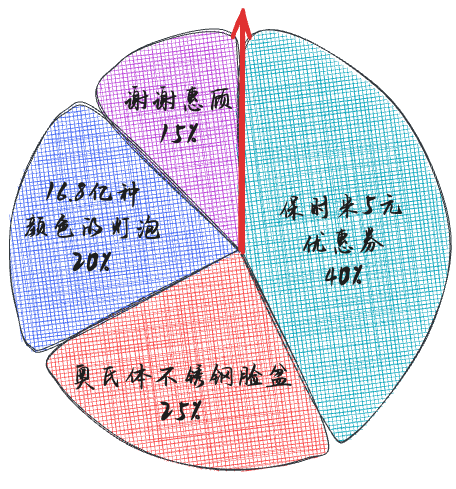

# 抽奖

> 说到抽奖，在我们日常生活中随处可见，比如说超市搞活动、年会抽奖、游戏中抽英雄皮肤等等。

## 1 轮盘选择法

轮盘选择法是一种直观易懂的抽奖模型，适用于奖品概率相对均匀的情况。其实现步骤包括：

将所有奖品按照中奖概率映射到一个圆盘上的不同扇区。
生成一个随机数作为指针，指向的扇区即为中奖奖品。

举个 🌰： 为了回馈各位米粉朋友们，雷总连夜说服高管，和当地超市联合举办了一项抽奖活动，凡超市购物满 1000 元者获赠一次抽奖机会。



从图中可以看出，中奖的概率是由旋转的角度所决定的，假如我们每次都从图中指针开始旋转，指针转过下图对应 `角度范围 + 整数圈` 即可获得对应的奖品。

| 奖品              | 中奖角度 | 角度范围   |
| ----------------- | -------- | ---------- |
| 保时米5元优惠券   | 144      | 1 ～ 144   |
| 奥氏体不锈钢脸盆  | 90       | 145 ～ 234 |
| 16.8 亿种颜色灯泡 | 72       | 235 ～ 306 |
| 谢谢惠顾          | 54       | 307 ～ 360 |

总之，轮盘选择法是一种简单的抽奖模型。

## 2 原神中的抽奖模型

原神作为比较典型的抽卡游戏，吸引了很多玩家，也因为其比较独特的 `保底机制` 让运气并不怎么好的玩家也能抽到自己喜欢的角色而受到玩家的喜欢。

可以用 `轮盘选择法的变形  + 优先级原则` 来描述这种有保底机制的抽奖模型。

### 2.1 保底机制

拿原神限定角色池来讲，一个池子中可能会抽到的东西包括这几种：

- 5星
  - 限定5星角色（1个）
  - 常驻5星角色（截止目前有7个）
- 4星
  - 限定4星角色（3个）
  - 其他4星角色（3个之外的其他所有4星）
- 3星
  - 3星武器

有如下抽卡保底规则：

- 90抽之内必出5星，10抽之内必出4星。
- 本次5星未出限定，下次5星必出限定。

### 2.2 优先级原则

优先级原则很简单，就是一次抽奖如果权重同时符合不同的星级，高星级优先。

### 2.3 轮盘选择法变形

如果完全根据轮盘角度来进行选择，实现让玩家必得某类物品的功能会比较繁琐，所以我们将轮盘简单的变形为下图所示：

我们以前面超市购物为例，权重上限我们设置为 `20`，那么正常情况下我们抽取到 `保时米5元优惠券` 所占的权重为 `20 * 40% = 8`
如果想让用户百分百抽到优惠券，那么我们只需将权重改为 `20 * 100% = 20`（也就是权重上限）就行了。


原神中的保底也是同样的道理，不同的是这个权重不是一下子变为权重上限的，而是动态调整的，为了计算方便，我们将整个权重上限设置为 10000，抽取限定角色池不同星级的权重可以用下面方法求出：

```ts
/**
 * 获取对应星级角色的权重
 * @param rank 星级
 * @param count 距上次出对应星级的抽数
 * @returns 权重
 */
function getRoleWeight(rank: number, count: number) {
  let res = 0
  count += 1
  if (rank === 5 && count <= 73) {
    res = 60
  } else if (rank === 5 && count >= 74) {
    res = 60 + 600 * (count - 73)
  } else if (rank === 4 && count <= 8) {
    res = 510
  } else if (rank === 4 && count >= 9) {
    res = 510 + 5100 * (count - 8)
  }
  return res
}
```

一次抽卡我们随机一个 1 ~ 10000 的正整数，通过对比是否落在对应星级的权重范围内，再根据星级 5 > 4 > 3 的顺序就可以确定这次抽卡最终的结果。

- 定义一个生成可以随机生成给定范围内整数的方法。

  ```ts
  /**
   * 得到随机数
   * @param min 最小值
   * @param max 最大值
   * @returns
   */
  export function getRandomNum(min = 1, max = 10000) {
    return Math.floor(Math.random() * (max - min + 1) + min)
  }

  /**
   * 得到安全随机数 https://developer.mozilla.org/zh-CN/docs/Web/API/Crypto/getRandomValues
   * @param min 最小值
   * @param max 最大值
   * @returns
   */
  function getSafeRandomNum(min = 1, max = 10000) {
    const range = max - min + 1 // 计算范围
    const maxRange = Math.pow(2, 32) // 创建一个 Uint32Array 用于存储随机值
    let array = new Uint32Array(1)
    let randomInt

    do {
      window.crypto.getRandomValues(array)
      randomInt = array[0] % maxRange
    } while (randomInt >= maxRange - (maxRange % range)) // 确保随机数可以被范围整除

    return min + (randomInt % range) // 调整范围并返回结果
  }
  ```

- 获取抽奖星级

  ```ts
  /**
   * 获取此次抽到的角色星级
   * @returns 3 ｜ 4 ｜ 5
   */
  function getRoleRank() {
    // 随机一个 1～10000的正整数
    const weight = getRandomNum()
    const weight5 = getRoleWeight(5, state.no_r5_count)
    const weight4 = getRoleWeight(4, state.no_r4_count)
  
    if (weight <= weight5) {
      return 5
    } else if (weight <= weight4) {
      return 4
    }
    return 3
  }
  ```

[原神抽卡体验](https://gacha.lyphol.cn/)

## 3 马尔可夫链和马尔可夫决策

在更多的抽奖或者类抽奖系统中，都会根据用户的不同行为，对最后的奖品获得给予干预，使得整个抽奖过程更加随机和更加的刺激紧张。

举个 🌰：某挑战综艺节目，通过第一关给参赛者 1W 元奖励，此时退出可以拿走奖金，继续挑战第二关并且成功的话奖金翻倍，挑战失败奖金归零，挑战者能拿到多少奖金跟挑战者的选择密切相关。

因此，在一些设计复杂的抽奖系统中，为了更好的分析最后的收益和用户行为，往往会引入 `马尔可夫链` 的概念。

### 3.1 什么是马尔可夫链

马尔可夫链（Markov chain），因俄国数学家安德烈·马尔可夫得名。马尔可夫链是指一个随机过程，在该过程中，从一个状态转移到另一个状态的概率只依赖于当前状态，而不依赖于过去的状态。这个性质称为马尔可夫性质或者无后效性。具体来说，给定一个状态空间和一个初始概率分布，马尔可夫链可以描述在这个状态空间中状态之间的转移规律。

有三大特性：

- 无记忆性
- 状态空间
- 概率转移

再举个🌰：小明早餐习惯在 `包子`、`油条`、`麻花` 中选择一种，小明今天吃什么，只会由昨天吃的是啥决定（毕竟只吃一种会腻），跟更早时间没关系。
好的，我们可以用马尔可夫链来描述小明的早餐选择习惯。

状态空间： 在这个例子中，状态空间就是小明每天早餐的选择，即包子、油条、麻花。

转移概率： 小明的早餐选择受到前一天早餐选择的影响，但他也可能随机改变选择。假如转移概率如下所示：

| #    | 包子 | 油条 | 麻花 |
| ---- | ---- | ---- | ---- |
| 包子 | 0.2  | 0.5  | 0.3  |
| 油条 | 0.4  | 0.1  | 0.5  |
| 麻花 | 0.3  | 0.3  | 0.4  |

在这个转移矩阵中，每一行代表前一天的选择，每一列代表今天的选择。例如，如果昨天选择了包子，今天选择包子的概率是0.2，选择油条的概率为0.4，选择麻花的概率是0.3。

通过这个马尔可夫链模型，我们可以分析小明的早餐选择习惯。根据转移概率矩阵，我们可以计算出长期来看，小明每天选择不同早餐的概率，从而了解他的早餐偏好以及是否存在某种稳定的选择模式。

假如初始概率分布为 `[[1,0,0]]`，即只吃过包子，那么想要计算小明长期的早餐习惯，只需要不断的将初始概率乘以转移矩阵就可以得到。

```ts
const initS = [[1, 0, 0]]
const a = [
  [0.2, 0.5, 0.3],
  [0.4, 0.1, 0.5],
  [0.3, 0.3, 0.4]
]

const b = matrixMultiply(initS, matrixPower(a, 100)) // [ [ 0.3, 0.3, 0.4 ] ]

// 矩阵乘法的辅助函数
function matrixMultiply(a: Matrix, b: Matrix): Matrix {
  const result: Matrix = new Array(a.length).fill(null).map(() => new Array(b[0].length).fill(0))
  for (let i = 0; i < a.length; i++) {
    for (let j = 0; j < b[0].length; j++) {
      for (let k = 0; k < b.length; k++) {
        result[i][j] += a[i][k] * b[k][j]
      }
    }
  }
  return result
}

// 矩阵幂运算的辅助函数
function matrixPower(m: Matrix, power: number): Matrix {
  let result: Matrix = m
  for (let p = 1; p < power; p++) {
    result = matrixMultiply(result, m)
  }
  return result
}
```

### 3.2 马尔可夫决策

马尔可夫决策过程是马尔可夫链的推广，不同之处在于添加了行动（允许选择）和奖励（给予动机）。


如上图所示：绿色的 `S` 球为状态，橙色的球 `a` 为动作，小数字为当前状态到下一个状态的行动概率。

[更多关于马尔可夫链的介绍视频](https://www.bilibili.com/video/BV1xa4y1w7aT)

## 4 和平精英扭蛋模型

我们用马尔可夫决策模型来分析下大家所熟知的吃鸡游戏 `和平精英` 中的抽奖。

以之前推出的 `硬糖少女303` 活动为例，玩家通过充值幸运币，参与该扭蛋活动，获取服装、枪械皮肤、阿斯顿马丁载具皮肤、伴飞小飞机空客H135，大致流程如下：


- 整体可以概括为 `抽扭蛋` -> `追加升星` -> `领奖励` 

- 总共有 `牛` `年` `大` `吉` `利` 5种扭蛋，抽到相同扭蛋概率：1 / 5 = 20%

- 扭蛋升星可能为 `1` `2` `3`，等级概率：

  | 星级 | 概率 |
  | ---- | ---- |
  | 1    | 82%  |
  | 2    | 17%  |
  | 3    | 1%   |

- 普通追加时，扭蛋不一致可能降低星级 `1` `2` 概率：

  | 降低星级 | 概率 |
  | -------- | ---- |
  | 1        | 75%  |
  | 2        | 25%  |

- 保护追加失败时不降星且如果前两次失败，第三次必成功，不同星级追加所需幸运币：

  | 星级 | 幸运币 |
  | ---- | ------ |
  | 1    | 6      |
  | 2    | 17     |
  | 3    | 53     |
  | 4    | 153    |
  | 5    | 430    |
  | 6    | 827    |

- 将扭蛋升级到对应星级后可以选择兑换奖励或者再次升星，如果物品不是你想要的可以半价折换为扭蛋碎片（是不是很厚道）
  各种道具所需要的碎片数量：

  | 星级 | 道具              | 兑换价值  | 折算价值  |
  | ---- | ----------------- | --------- | --------- |
  | 0    | 碎片              | 2         | 2         |
  | 1    | 碎片              | 12        | 12        |
  | 2    | 碎片              | 36        | 36        |
  | 3    | 跳伞皮肤/背包挂件 | 108       | 54        |
  | 4    | 背包皮肤/头盔皮肤 | 320       | 160       |
  | 5    | M416枪皮肤/衣服   | 960       | 480       |
  | 6    | 徽章              | 2880      | 2880      |
  | 7    | 徽章 \* 3         | 2880 \* 3 | 2880 \* 3 |

已知阿斯顿马丁载具皮肤需要一个徽章，也就是 2880 碎片，我们以全部普通追加的方式来建立概率转移矩阵，计算获取一个载具皮肤的期望花费

```ts
// 初始概率分布
const initState: Matrix = [[1, 0, 0, 0, 0, 0, 0, 0]]

// 记录成本的数学期望
const x: number[] = []
// 记录获取碎片数的数学期望
const y: number[] = []

// 花6元开始游戏
x[0] = 6
// 获取碎片数 0.82 * 2 + 0.17 * 12 + 0.01 * 36
y[0] = 16.5

// 散点图数据
const scatterData: Matrix = []
// i 为追加的次数
for (let i = 2; i <= 100; i++) {
  // i次追加后星星数的概率分布
  const m = matrixMultiply(initState, matrixPower(matrix, i))
  // i-1次追加后星星数的概率分布
  const n = matrixMultiply(initState, matrixPower(matrix, i - 1))
  // index
  const j = i - 1
  // 计算每次追加的成本
  x[j] = x[j - 1] + 6 * n[0][0]

  // 循环计算多次追加的情况
  y[j] =
    m[0][0] * n[0][1] * 2 +
    m[0][0] * n[0][2] * 4 +
    m[0][1] * 12 +
    m[0][2] * 36 +
    m[0][3] * 54 +
    m[0][4] * 160 +
    m[0][5] * 480 +
    m[0][6] * 2880 +
    m[0][7] * 2880 * 3

  const cost = 2880 * (x[j] / y[j]) // 计算收集 2880 个碎片的成本

  // 散点数据信息
  scatterData.push([i, cost])
  console.log('cost:', i, cost)
}
```


从散点图可以看出，普通追加期望会收敛到 `936` 左右，也就是说从长期看，平均花费 936 元可以获得一辆车皮肤。！！！注意：这只是样本数据足够多的情况下的一个平均期望，并不能代表一次抽奖的结果。

## 5 抽奖收益和心理学

我们在参加抽奖游戏时，往往会通过各种方法去寻找最佳的抽奖策略，甚至包括各种玄学，同样的抽奖系统的设计者也会去考虑商家的利益。

### 5.1 商家利益

可以发现，商家的利益是和玩家的抽卡策略息息相关的，拿一种特殊的抽奖机制来说：玩家的最佳策略要么是 `0`， 要么是 `∞`，这种策略会导致玩家分为两类，要么是 `白嫖党`，要么是 `氪金大佬`。往往这类抽奖游戏中，是带有 `Whale Property（巨鲸属性或氪佬属性）`的，而它们的的抽奖概率一般来说会随着抽奖次数的增加而增大。而带有巨鲸属性的抽奖游戏所获得的收益肯定是大于非巨鲸属性游戏的，市面上的游戏大多都符合 `二八定律`（20% 的玩家贡献了80%的收益）。

### 5.2 玩家心理学

如果一个玩家在抽了n次后一直没抽到自己想要的物品，那么玩家可能就会心态奔溃，那么对厂家来说就会失去这部分玩家，毕竟一个游戏继续要 `营收` 也需要 `热度`。所以一般厂商会平衡两者的关系，比如前几抽有折扣或者引入保底机制，这样既保障了利益，又能吸引到一些轻氪玩家来活跃游戏热度。

## 6 总结

- 简单的抽奖模型：轮盘选择法
- 原神中的抽奖模型：轮盘选择法变形 + 优先级原则 实现原神抽卡中的保底机制
- 马尔可夫链的介绍以及概率转移矩阵和稳态分布
- 马尔可夫链和转移矩阵在扭蛋模型中的应用
- 设计抽奖游戏需要考虑的因素
